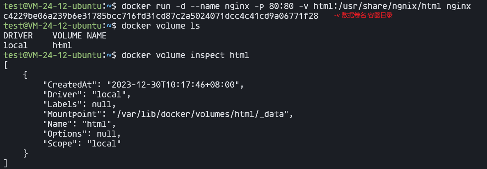
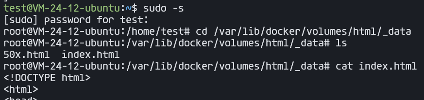

## 查找命令
#### find

作用: 在指定目录下查找文件
语法: `find dirName -option fileName`
举例:
   -  `find  .  –name "*.java"`			在当前目录及其子目录下查找.java结尾文件
   -  `find  /itcast  -name "*.java"`	在/itcast目录及其子目录下查找.java结尾的文

#### grep

作用: 从指定文件中查找指定的文本内容
语法: `grep word fileName`
举例: 
   -  `grep Hello HelloWorld.java`	查找HelloWorld.java文件中出现的Hello字符串的位置
   -  `grep hello *.java`			查找当前目录中所有.java结尾的文件中包含hello字符串的位置


## docker
### 数据卷

`数据卷（volume）`是一个虚拟目录，是容器内目录与宿主机目录之间映射的桥梁。
以Nginx为例，我们知道Nginx中有两个关键的目录：


- html：放置一些静态资源
- conf：放置配置文件

:::tip
如果我们要让Nginx代理我们的静态资源，最好是放到html目录；如果我们要修改Nginx的配置，最好是找到conf下的nginx.conf文件。
但遗憾的是，容器运行的Nginx所有的文件都在容器内部，读写都非常不方便。所以我们通常会利用数据卷将两个目录与宿主机目录关联，
:::
#### 基本命令

| 命令                  | 说明                 |
| --------------------- | -------------------- |
| docker volume create  | 创建数据卷           |
| docker volume ls      | 查看所有的数据卷     |
| docker volume rm      | 删除指定的数据卷     |
| docker volume inspect | 查看某个数据卷的详情 |
| docker volume prune   | 清除数据卷           |

`-v html:/usr/share/nignx/html` 挂载目录

`-v /home/test/mysql/mysql:/usr/mysql/mysql`  映射宿主机上

#### 示例




之后就可以随意修改了

### 自定义镜像
```
docker build -t docker-demo:1.0 .
```
命令说明：
- `docker build` : 就是构建一个docker镜像
- `-t docker-demo:1.0 `：-t参数是指定镜像的名称（repository和tag）
- `.` : 最后的点是指构建时Dockerfile所在路径，由于我们进入了demo目录，所以指定的是.代表当前目录，也可以直接指定Dockerfile目录：
  ```
  docker build -t docker-demo:1.0 /root/demo
  ```
### DockerCompose
docker-compose.yml
```yml
version: "3.8"
 services:
  mysql:
    image: mysql:5.7.25
    environment:
     MYSQL_ROOT_PASSWORD: 123 
    volumes:
     - "/tmp/mysql/data:/var/lib/mysql"
     - "/tmp/mysql/conf/hmy.cnf:/etc/mysql/conf.d/hmy.cnf"
  web:
    build: .
    ports:
     - "8090:8090"
```
基本命令
```bash
# 执行当前目录下的docker-compose.yml文件
docker compose up
# 后台启动
docker compose up -d
# 使用特定的配置文件
docker compose -f /home/docker-compose.yml up -d
# 类似 docker ps 
docker-compose ps

docker-compose status [配置中的一个服务]

docker-compose pause [配置中的一个服务]

docker-compose unpause [配置中的一个服务]

docker-compose restart [配置中的一个服务]

```

> 为了避免每次使用docker命令都需要加上sudo权限，可以将当前用户加入安装中自动创建的docker用户组
> [如何在 Ubuntu 22.04 LTS 中安装 Docker 和 Docker Compose](https://linux.cn/article-14871-1.html#:~:text=%E5%9C%A8%20Ubuntu%2022.04%20LTS%20%E4%B8%AD%E5%AE%89%E8%A3%85%20Docker%201%201%E3%80%81%E6%9B%B4%E6%96%B0,%EF%BC%88%E9%80%89%E5%81%9A%EF%BC%89%20%E9%BB%98%E8%AE%A4%E6%83%85%E5%86%B5%E4%B8%8B%EF%BC%8CDocker%20%E5%AE%88%E6%8A%A4%E8%BF%9B%E7%A8%8B%E7%BB%91%E5%AE%9A%E5%88%B0%20Unix%20%E5%A5%97%E6%8E%A5%E5%AD%97%E8%80%8C%E4%B8%8D%E6%98%AF%20TCP%20%E7%AB%AF%E5%8F%A3%E3%80%82%20)
```
sudo usermod -aG docker $USER
```

### 基操
#### 镜像（images）
```
docker pull ubuntu:20.04：拉取一个镜像
docker images：列出本地所有镜像
docker image rm ubuntu:20.04 或 docker rmi ubuntu:20.04：删除镜像ubuntu:20.04
docker [container] commit CONTAINER IMAGE_NAME:TAG：创建某个container的镜像
docker save -o ubuntu_20_04.tar ubuntu:20.04：将镜像ubuntu:20.04导出到本地文件ubuntu_20_04.tar中
docker load -i ubuntu_20_04.tar：将镜像ubuntu:20.04从本地文件ubuntu_20_04.tar中加载出来
```
#### 容器(container)
```
docker [container] create -it ubuntu:20.04：利用镜像ubuntu:20.04创建一个容器。
docker ps -a：查看本地的所有容器
docker [container] start CONTAINER：启动容器
docker [container] stop CONTAINER：停止容器
docker [container] restart CONTAINER：重启容器
docker [contaienr] run -itd ubuntu:20.04：创建并启动一个容器
docker [container] attach CONTAINER：进入容器
先按Ctrl-p，再按Ctrl-q可以挂起容器
docker [container] exec CONTAINER COMMAND：在容器中执行命令
docker [container] rm CONTAINER：删除容器
docker container prune：删除所有已停止的容器
docker export -o xxx.tar CONTAINER：将容器CONTAINER导出到本地文件xxx.tar中
docker import xxx.tar image_name:tag：将本地文件xxx.tar导入成镜像，并将镜像命名为image_name:tag
docker export/import与docker save/load的区别：
export/import会丢弃历史记录和元数据信息，仅保存容器当时的快照状态
save/load会保存完整记录，体积更大
docker top CONTAINER：查看某个容器内的所有进程
docker stats：查看所有容器的统计信息，包括CPU、内存、存储、网络等信息
docker cp xxx CONTAINER:xxx 或 docker cp CONTAINER:xxx xxx：在本地和容器间复制文件
docker rename CONTAINER1 CONTAINER2：重命名容器
docker update CONTAINER --memory 500MB：修改容器限制
```
#### 例子
```
创建 运行镜像
docker run -p 20000:22 --name my_docker_server -itd docker_lesson:1.0 
```
## mysql
### 导出完整数据库
```
用mysqldump命令导出数据库（此命令的路径即mysql的安装路径）
mysqldump -u用户名 -p 数据库名 > 数据库名.sql
```
例如
```
/usr/local/mysql/bin
mysqldump -uroot -p aaa > aaa.sql
```
2、只导出表结构
如果只需要导出表结构
```
mysqldump -u用户名 -p -d 数据库名 > 数据库名.sql
```
例如
```
mysqldump -uroot -p -d aaa >aaa.sql
可以使用以下命令找到导出的数据库
find / -name 数据库名.sql
```
### 导入数据库
1、使用mysql命令导入
mysql -u用户名 -p 数据库名 < 数据库名.sql
例如
```
mysql -uroot -p aaa < aaa.sql
```
2、使用sources命令导入
先进入到mysql中
```
mysql> create databases aaa;      #创建新的数据库
mysql> use aaa;                   #使用已创建的数据库
mysql> set names utf-8;           #设置编码
mysql> source /aaa.sql            #导入sql文件，注意sql的路径
```
## vim
```
(1) i：进入编辑模式
    (2) ESC：进入一般命令模式
    (3) h 或 左箭头键：光标向左移动一个字符
    (4) j 或 向下箭头：光标向下移动一个字符
    (5) k 或 向上箭头：光标向上移动一个字符
    (6) l 或 向右箭头：光标向右移动一个字符
    (7) n<Space>：n表示数字，按下数字后再按空格，光标会向右移动这一行的n个字符
    (8) 0 或 功能键[Home]：光标移动到本行开头
    (9) $ 或 功能键[End]：光标移动到本行末尾
    (10) G：光标移动到最后一行
    (11) :n 或 nG：n为数字，光标移动到第n行
    (12) gg：光标移动到第一行，相当于1G
    (13) n<Enter>：n为数字，光标向下移动n行
    (14) /word：向光标之下寻找第一个值为word的字符串。
    (15) ?word：向光标之上寻找第一个值为word的字符串。
    (16) n：重复前一个查找操作
    (17) N：反向重复前一个查找操作
    (18) :n1,n2s/word1/word2/g：n1与n2为数字，在第n1行与n2行之间寻找word1这个字符串，并将该字符串替换为word2
    (19) :1,$s/word1/word2/g：将全文的word1替换为word2
    (20) :1,$s/word1/word2/gc：将全文的word1替换为word2，且在替换前要求用户确认。
    (21) v：选中文本
    (22) d：删除选中的文本
    (23) dd: 删除当前行
    (24) y：复制选中的文本
    (25) yy: 复制当前行
    (26) p: 将复制的数据在光标的下一行/下一个位置粘贴
    (27) u：撤销
    (28) Ctrl + r：取消撤销
    (29) 大于号 >：将选中的文本整体向右缩进一次
    (30) 小于号 <：将选中的文本整体向左缩进一次
    (31) :w 保存
    (32) :w! 强制保存
    (33) :q 退出
    (34) :q! 强制退出
    (35) :wq 保存并退出
    (36) :set paste 设置成粘贴模式，取消代码自动缩进
    (37) :set nopaste 取消粘贴模式，开启代码自动缩进
    (38) :set nu 显示行号
    (39) :set nonu 隐藏行号
    (40) gg=G：将全文代码格式化
    (41) :noh 关闭查找关键词高亮
    (42) Ctrl + q：当vim卡死时，可以取消当前正在执行的命令
```
## ssh 免密登录
```
ssh-keygen            先生成一对密钥
ssh-keygen -R 127.0.0.1   清除公钥信息
ssh-copy-id  127.0.0.1    发送公钥
/.ssh 下创建config文件
Host 别名
        Hostname  127.0.0.1
        User 登录名
最后即可使用ssh 别名登录
```
