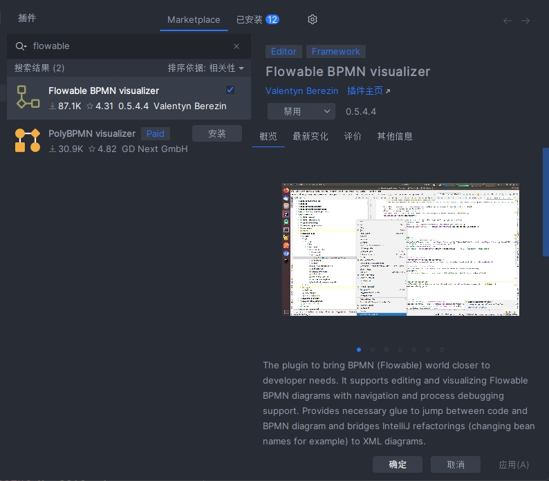

[activiti工作流核心java api使用，activiti退回、跳过、强制结束实现，BpmnModel模型操作，运行中流程图、获取流程变量、候选人操作](https://blog.csdn.net/a771664696/article/details/118358296?spm=1001.2014.3001.5506)

[Flowable常用网关使用介绍](https://blog.csdn.net/qq_41609208/article/details/132732054)

```idea插件画图```


```maven```

```xml
        <!-- https://mvnrepository.com/artifact/org.flowable/flowable-spring-boot-starter -->
        <dependency>
            <groupId>org.flowable</groupId>
            <artifactId>flowable-spring-boot-starter</artifactId>
            <version>6.7.0</version>
        </dependency>
```
手动下载数据库，下载后，执行里面的database脚本即可
https://github.com/flowable/flowable-engine/releases/tag/flowable-6.7.0

`有了流程图 需要先发布才能使用`
```java
    @Test
    void contextLoads() {
        Deployment deployment = repositoryService.createDeployment()
                .addClasspathResource("static/test.bpmn20.xml")
                .deploy();
        ProcessDefinition processDefinition = repositoryService.createProcessDefinitionQuery()
                .deploymentId(deployment.getId())
                .singleResult();
        System.out.println("流程定义已部署：" + processDefinition.getName());

    }
```

```java

/**
 * @author mishu
 * @since 2025/7/5
 * @desc  排他网关
 */
@Slf4j
@SpringBootTest
public class test02 {

    @Autowired
    private RuntimeService runtimeService;

    @Autowired
    private TaskService taskService;

    @Autowired
    private RepositoryService repositoryService;

    @Test
    void name() {
        // 1. 部署流程
    Deployment deployment = repositoryService.createDeployment()
            .addClasspathResource("static/test02.bpmn20.xml")
            .name("测试流程部署02")
            .deploy();
    log.info("流程已部署: id={}, name={}", deployment.getId(), deployment.getName());
    }

    @Test
    void start() {
      //绑定业务 dataId,不唯一
        ProcessInstance instance = runtimeService.startProcessInstanceByKey("test02", "dataId");
        log.info("流程已启动: id={}, definitionId={}", instance.getId(), instance.getProcessDefinitionId());
// instanc_id       3b387e55-594c-11f0-8fa3-1cbfc07abb08
    }

    @Test
    void handle() {
//        用户一处理
        Task task = taskService.createTaskQuery()
                .taskAssignee("1")
                .processInstanceId("3b387e55-594c-11f0-8fa3-1cbfc07abb08")
                .singleResult();

        HashMap<String, Object> map = new HashMap<>();
        map.put("temp","2");

        taskService.complete(task.getId(), map);

    }

    @Test
    void handle02() {
        //        用户2处理
        Task task = taskService.createTaskQuery()
                .taskAssignee("3")
                .processInstanceId("1268bbd4-594e-11f0-b029-1cbfc07abb08")
                .singleResult();

        taskService.complete(task.getId());

    }

    @Test
    void test03() {
        ProcessInstance instance = runtimeService.startProcessInstanceByKey("test02", "dataId");
        log.info("流程已启动: id={}, definitionId={}", instance.getId(), instance.getProcessDefinitionId());

        //        用户一处理
        Task task = taskService.createTaskQuery()
                .taskAssignee("1")
                .processInstanceId(instance.getId())
                .singleResult();

        HashMap<String, Object> map = new HashMap<>();
        map.put("temp","1");

        taskService.complete(task.getId(), map);

    }
}

```
## 表说明
[chatgpt.com](https://chatgpt.com/share/6868a30b-e718-8004-ae08-867ece93a643)


🧩 一、流程定义相关表（部署级）
| 表名                      | 说明                               |
| ----------------------- | -------------------------------- |
| **ACT\_RE\_DEPLOYMENT** | 存放流程部署信息，如部署时间、名称等。RE=Repository |
| **ACT\_RE\_PROCDEF**    | 存储流程定义数据（如流程定义ID、KEY、版本等）        |
| **ACT\_GE\_BYTEARRAY**  | 存储部署时上传的 BPMN XML 和图片等二进制资源      |
| **ACT\_GE\_PROPERTY**   | 引擎属性表，如数据库版本号、唯一标识生成器等           |

🚀 二、流程运行时数据（运行中流程）
| 表名                        | 说明                     |
| ------------------------- | ---------------------- |
| **ACT\_RU\_EXECUTION**    | 正在执行的流程实例及其执行路径信息      |
| **ACT\_RU\_TASK**         | 正在运行的用户任务信息（待办任务）      |
| **ACT\_RU\_IDENTITYLINK** | 正在运行任务的参与者信息（如候选人、候选组） |
| **ACT\_RU\_VARIABLE**     | 正在运行流程中的流程变量           |
| **ACT\_RU\_JOB**          | 定时任务、异步任务（等待执行）        |


说明：RU = Runtime，运行中。流程执行完后这些表中的数据会被清除，移到历史表。

✅ 三、任务相关表（与 ACT_RU_TASK 配合）
| 表名                        | 说明                   |
| ------------------------- | -------------------- |
| **ACT\_RU\_TASK**         | 当前正在运行的任务            |
| **ACT\_RU\_IDENTITYLINK** | 任务的参与者关联信息（如代理人、候选组） |
| **ACT\_RU\_VARIABLE**     | 与任务相关的运行时变量          |


📜 四、历史数据表（已完成流程/任务）
| 表名                      | 说明             |
| ----------------------- | -------------- |
| **ACT\_HI\_PROCINST**   | 已完成的流程实例记录     |
| **ACT\_HI\_TASKINST**   | 已完成的任务记录       |
| **ACT\_HI\_ACTINST**    | 已完成的节点（活动）记录   |
| **ACT\_HI\_VARINST**    | 历史变量记录         |
| **ACT\_HI\_DETAIL**     | 详细历史信息，如表单字段值等 |
| **ACT\_HI\_COMMENT**    | 评论和说明          |
| **ACT\_HI\_ATTACHMENT** | 附件信息           |


说明：HI = History

🛠 五、通用辅助表
| 表名                     | 说明                        |
| ---------------------- | ------------------------- |
| **ACT\_GE\_BYTEARRAY** | 存储二进制数据，如流程定义文件（BPMN）、表单等 |
| **ACT\_GE\_PROPERTY**  | 引擎的配置信息，例如下一个ID值、版本号等     |


💡 表名命名规则总结
| 前缀        | 含义               |
| --------- | ---------------- |
| `ACT_RE_` | Repository（流程定义） |
| `ACT_RU_` | Runtime（运行时数据）   |
| `ACT_HI_` | History（历史数据）    |
| `ACT_GE_` | General（通用数据）    |
